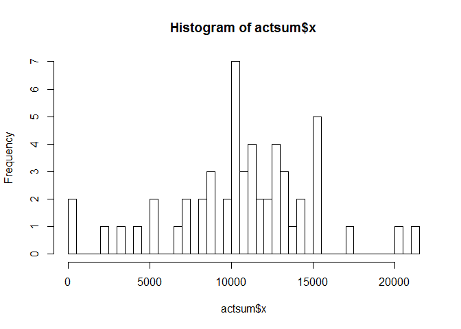
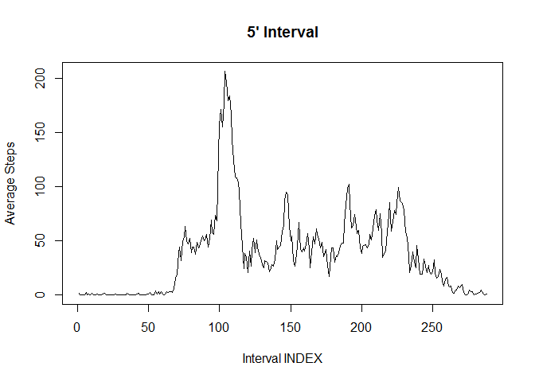
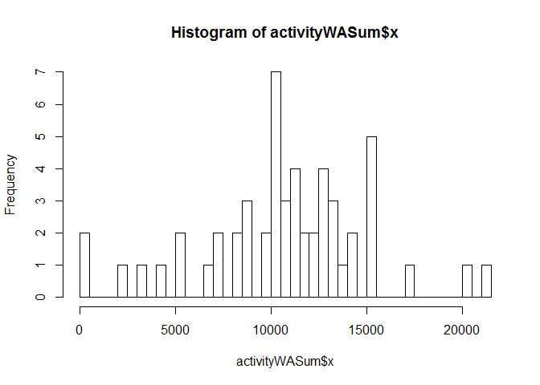
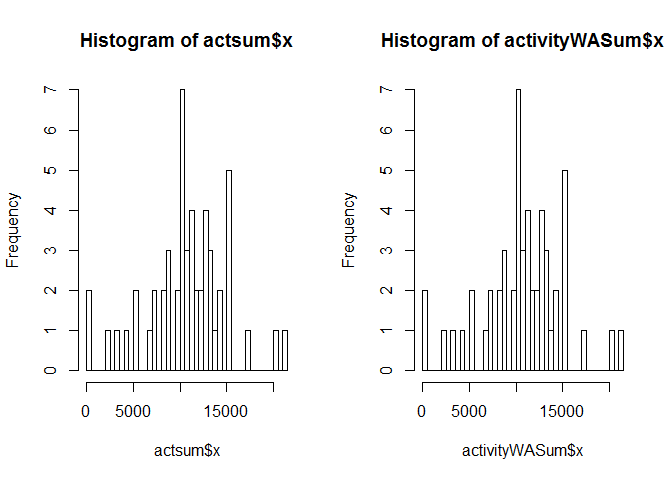
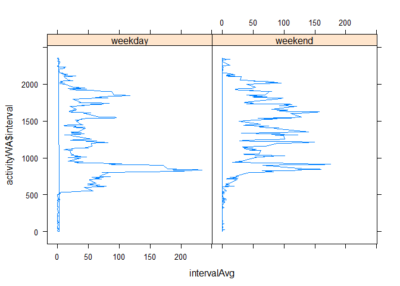

# Reproducible Research: Peer Assessment 1
Lineesh  


# Loading and preprocessing the data
##Load data

```r
activity <- read.csv(unz("activity.zip", "activity.csv"))
```

##Transform data

```r
activity$date <- as.Date(activity$date)
```


# What is mean total number of steps taken per day?
##Find mean total number of steps taken per day.
##Make a histogram of the total number of steps taken each day

```r
actsum <- aggregate(x=activity$steps, by=list(Category=activity$date), FUN=sum)
hist(actsum$x,breaks=61)
```

 


# What is the average daily activity pattern?
##Calculate and report the mean and median of the total number of steps taken per day

```r
mean(actsum$x,na.rm=TRUE)
```

```
## [1] 10766.19
```

```r
median(actsum$x,na.rm=TRUE)
```

```
## [1] 10765
```
##Find the average daily activity pattern
##Make a time series plot of the 5-minute interval (x-axis) and the average number of steps taken, averaged across all days (y-axis)

```r
actWONA <- subset(activity,complete.cases(activity)==TRUE) 
splitByTime <- split(actWONA, actWONA$interval, drop=TRUE)
intervalAvg <- sapply(splitByTime, function(x) mean(x$steps))
plot(intervalAvg, type="l", main="5' Interval", ylab="Average Steps", xlab="Interval INDEX")
```

 

##Find which 5-minute interval, on average across all the days in the dataset, contains the maximum number of steps

```r
intervalAvg[which.max(intervalAvg)]
```

```
##      835 
## 206.1698
```


# Imputing missing values
##Calculate and report the total number of missing values in the dataset 

```r
nrow(activity[is.na(activity$steps),])
```

```
## [1] 2304
```

##Devise a strategy for filling in all of the missing values in the dataset. Our strategy is to fill the missing values with the average for the time interval. The new dataset is activityWA.

```r
activityWA <- cbind(actWONA, intervalAvg)
activityWA <- cbind(activityWA, is.na(activityWA$steps))
names(activityWA) <- c("steps", "date", "interval", "intervalAvg", "originalAbsent")

for(i in activityWA$steps) if(is.na(i)) activityWA$steps <- activityWA$intervalAvg

for (i in 1:nrow(activityWA)) {
  if (is.na(activityWA[i,]$steps)) {
		activityWA[i,]$steps <- activityWA[i,]$intervalAvg
	}
}

activityWA$steps <- round(activityWA$steps)
```

##Make a histogram of the total number of steps taken each day.

```r
activityWASum <- aggregate(x=activityWA$steps, by=list(Category=activityWA$date), FUN=sum)
hist(activityWASum$x,breaks=61)
```

 

##Calculate and report the mean and median total number of steps taken per day.

```r
mean(activityWASum$x,na.rm=TRUE)
```

```
## [1] 10766.19
```

```r
median(activityWASum$x,na.rm=TRUE)
```

```
## [1] 10765
```

##Compare the totals before and after filling missing values

```r
par(mfrow=c(1,2))
hist(actsum$x,breaks=61)
hist(activityWASum$x,breaks=61)
```

 


# Are there differences in activity patterns between weekdays and weekends?
##Compare the difference in activity between weekdays and weekends

```r
activityWA$daytype <- ifelse(weekdays(activityWA$date) %in% c("Saturday","Sunday"),"weekend", "weekday")
activityWA$daytype <- as.factor(activityWA$daytype)

for (i in unique(activityWA$interval)) {
  activityWA[activityWA$daytype == "weekday" & activityWA$interval == i,]$intervalAvg <- mean(activityWA[activityWA$daytype == "weekday" & activityWA$interval == i,]$steps)
}

for (i in unique(activityWA$interval)) {
	activityWA[activityWA$daytype == "weekend" & activityWA$interval == i,]$intervalAvg <- mean(activityWA[activityWA$daytype == "weekend" & activityWA$interval == i,]$steps)
}

library("lattice")
xyplot(activityWA$interval ~ intervalAvg | factor(activityWA$daytype), type="l", data=activityWA)
```

 
